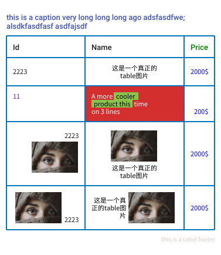

# tableimage generator

Generates a table inside of a image based on the provided data

[](https://pkg.go.dev/github.com/bububa/tableimage)
[](https://github.com/bububa/tableimage/actions/workflows/go.yml)
[](https://github.com/bububa/tableimage/actions/workflows/goreleaser.yml)
[](https://github.com/bububa/tableimage)
[](https://goreportcard.com/report/github.com/bububa/tableimage)
[](https://github.com/bububa/tableimage/blob/master/LICENSE)
[](https://GitHub.com/bububa/tableimage/releases/)

### Features

- support border, font, color, padding, margin etc. style settings
- style inherit, could set style in cell, row, table level
- support image in table

### Example:



### Usage

```go
package main

import (
	"image"
	"log"
	"os"

	"github.com/bububa/tableimage"
	"github.com/llgcode/draw2d"
)

func main() {
	imageURL := "https://images.pexels.com/photos/906052/pexels-photo-906052.jpeg?auto=compress&cs=tinysrgb&dpr=2&h=750&w=200"

	headerFont := &tableimage.Font{
		Size: 13,
		Data: &draw2d.FontData{
			Name:   "Roboto",
			Family: draw2d.FontFamilySans,
			Style:  draw2d.FontStyleBold,
		},
	}
	headerStyle := &tableimage.Style{
		Font: headerFont,
	}
	ti, err := tableimage.New(
		tableimage.WithBgColor("#FFFFFF"),
		tableimage.WithBorderColor("#0277BD"),
		tableimage.WithFontSize(11),
		tableimage.WithFontData(&draw2d.FontData{
			Name:   "NotoSansCJKsc",
			Family: draw2d.FontFamilySans,
			Style:  draw2d.FontStyleNormal,
		}),
		tableimage.WithFontFolder("./font"),
	)
	if err != nil {
		log.Fatalln(err)
		return
	}
	rows := []tableimage.Row{
		{
			Style: headerStyle,
			Cells: []tableimage.Cell{
				{
					Text: "Id",
				},
				{
					Text: "Name",
				},
				{
					Style: &tableimage.Style{
						Color: "#008000",
					},
					Text: "Price",
				},
			},
		},
		{
			Cells: []tableimage.Cell{
				{
					Text: "2223",
				},
				{
					Style: &tableimage.Style{
						Color:    "#000",
						MaxWidth: 100,
						Align:    tableimage.CENTER,
					},
					Text: "这是一个真正的table图片",
				},
				{
					Style: &tableimage.Style{
						Color: "#0000ff",
					},
					Text: "2000$",
				},
			},
		},
		{
			Cells: []tableimage.Cell{
				{
					Style: &tableimage.Style{
						Color:  "#6A1B9A",
						VAlign: tableimage.TOP,
					},
					Text: "11",
				},
				{
					Style: &tableimage.Style{
						Color:    "#FFF",
						MaxWidth: 100,
						BgColor:  "#D32F2F",
					},
					Text: "A more cooler product this time on 3 lines",
				},
				{
					Style: &tableimage.Style{
						Color:  "#0000ff",
						Align:  tableimage.RIGHT,
						VAlign: tableimage.BOTTOM,
					},
					Text: "200$",
				},
			},
		},
		{
			Cells: []tableimage.Cell{
				{
					Text: "2223",
					Image: &tableimage.Image{
						URL:     imageURL,
						Size:    image.Pt(80, 0),
						VAlign:  tableimage.BOTTOM,
						Padding: tableimage.NewPaddingY(4),
					},
					Style: &tableimage.Style{
						Align: tableimage.RIGHT,
					},
				},
				{
					Style: &tableimage.Style{
						Color:    "#000",
						MaxWidth: 100,
						Align:    tableimage.CENTER,
					},
					Image: &tableimage.Image{
						URL:     imageURL,
						Size:    image.Pt(80, 0),
						VAlign:  tableimage.TOP,
						Padding: tableimage.NewPaddingY(4),
					},
					Text: "这是一个真正的table图片",
				},
				{
					Style: &tableimage.Style{
						Color: "#0000ff",
					},
					Text: "2000$",
				},
			},
		},
		{
			Cells: []tableimage.Cell{
				{
					Text: "2223",
					Image: &tableimage.Image{
						URL:     imageURL,
						Size:    image.Pt(80, 0),
						Align:   tableimage.LEFT,
						Padding: tableimage.NewPaddingX(4),
					},
					Style: &tableimage.Style{
						VAlign: tableimage.BOTTOM,
					},
				},
				{
					Style: &tableimage.Style{
						Color:    "#000",
						MaxWidth: 150,
						Align:    tableimage.RIGHT,
						VAlign:   tableimage.MIDDLE,
					},
					Image: &tableimage.Image{
						URL:     imageURL,
						Size:    image.Pt(80, 0),
						Align:   tableimage.RIGHT,
						Padding: tableimage.NewPaddingX(4),
					},
					Text: "这是一个真正的table图片",
				},
				{
					Style: &tableimage.Style{
						Color: "#0000ff",
					},
					Text: "2000$",
				},
			},
		},
	}
	img, err := ti.Draw(rows)
	if err != nil {
		log.Fatalln(err)
		return
	}
	f, err := os.Create("./test.png")
	if err != nil {
		log.Fatalln(err)
		return
	}
	defer f.Close()
	tableimage.Write(f, img, tableimage.PNG)
}
```
